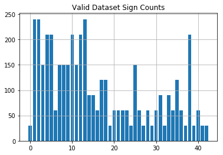

# **Traffic Sign Recognition** 

February 22, 2020 - John Robinson

[](http://www.udacity.com/drive)

**Build a Traffic Sign Recognition Project**

**Project 3** in Udacity’s Self-Driving Car Nanodegree

The goals / steps of this project are the following:
* Load the data set (see below for links to the project data set)
* Explore, summarize and visualize the data set
* Design, train and test a model architecture
* Use the model to make predictions on new images
* Analyze the softmax probabilities of the new images
* Summarize the results with a written report

My Project Repository: https://github.com/johnrobinsn/udacity-traffic-sign-classifier

Included with the submission:
* Jupyter notebook with all code for loading, analyzing, augmenting the data as well as all code to create the model architecture train it and test it.
* HTML output from the jupyter notebook from the final training run (Final_run.html).
* This document as a project writeup.

---

## Dataset Exploration

Training, Validation and Test data were provided as a part of this project as pickled archive files. 

The size of the training data was 34,799 samples.

The size of the validation data was 4,410 samples.

The size of the test data was 12,630 samples.

Each of these samples is an image of a German traffic sign.  Each image is a 32x32x3 RGB image and each image has a label that ranges from 0-42 (for 43 possible labels or classes).

Another small dataset (csv) is provided that gives human readable names for each of the numeric labels as follows:

['Speed limit (20km/h)',
 'Speed limit (30km/h)',
 'Speed limit (50km/h)',
 'Speed limit (60km/h)',
 'Speed limit (70km/h)',
 'Speed limit (80km/h)',
 'End of speed limit (80km/h)',
 'Speed limit (100km/h)',
 'Speed limit (120km/h)',
 'No passing',
 'No passing for vehicles over 3.5 metric tons',
 'Right-of-way at the next intersection',
 'Priority road',
 'Yield',
 'Stop',
 'No vehicles',
 'Vehicles over 3.5 metric tons prohibited',
 'No entry',
 'General caution',
 'Dangerous curve to the left',
 'Dangerous curve to the right',
 'Double curve',
 'Bumpy road',
 'Slippery road',
 'Road narrows on the right',
 'Road work',
 'Traffic signals',
 'Pedestrians',
 'Children crossing',
 'Bicycles crossing',
 'Beware of ice/snow',
 'Wild animals crossing',
 'End of all speed and passing limits',
 'Turn right ahead',
 'Turn left ahead',
 'Ahead only',
 'Go straight or right',
 'Go straight or left',
 'Keep right',
 'Keep left',
 'Roundabout mandatory',
 'End of no passing',
 'End of no passing by vehicles over 3.5 metric tons']

## Visualization of the Dataset

Here are a few randomly selected images from the training set to demonstrate what the sign images look like:

 


Next I analyzied the distribution of classes within each dataset by using a histogram for each:

Training Set


Validation Set


Test Set


## Design and Test a Model Architecture

During the process of experimenting with different training models.  I ended up making changes along the way to how I preprocessed the image data.  I originally started with the model taking the 3 channel RGB images of the signs as provided, but was gettting validation accuracy of <90%.  So I decided to try grayscale variants of the images, since the additional color information wasn't completely necessary to the task of classifying the signs.  I converted to grayscale by taking the average of the 3 color channels for each pixel.  This resulted in a good increase to validation accuracy.  Similarly I normalized the image grayscale pixel data to range from -1.0 to 1.0. But my validation accuracy numbers were still only at about 90%.  It was at this point that I analyzed the distribution of classes and found that many of the classes were under-represented within the datasets.  I decided to augment the dataset by generating additional images.  I first combined the original train and validation datasets to maximize the number of images that I could draw upon (I left the original test dataset untouched throughout this project).  Then for the combined dataset, I did a count of how many images were available and for each class that had less than 2000 images, I generated additional images.  The new images were generated by randomly sampling an image from the class in question and then applying a random rotate (from -15-15 degress) and scale (0.8-1.2) to the image.  The code for generating a new image from an existing source image can be found in the transformImage function in the project notebook.  I chose not to do any translation in the transformImage function, since weight sharing within the convolution layers makes the model largely translation invariant.  Here is an example of a generated image.  Other areas to experiment with might be to do additional colorspace tranformation to change improve/normalize lighting or to improve contrast.  I then regenerated the validation dataset by taking 10% of the newly augmented dataset.

Source Image


Augmented Image


## Model Architecture

I had started off with the LeNet-5 architecture that was covered in class.  But even with the data augmentation the LeNet-5 model not enough to get the validation accuracy greater than 93%.  Therefore a started looking at ways to improve the model architecture.  After reading the provided Lecun paper [Traffic Sign Recognition with Multi-Scale Convolutional Networks](http://yann.lecun.com/exdb/publis/pdf/sermanet-ijcnn-11.pdf) and being sufficiently inspired, I decided to add an additional convolution layer/max pool/relu layer followed by dropout (75% keep during training) and using a single fully connected layer to classify into one of the 43 labels.

My final model consisted of the following layers:

| Layer         		|     Description	        					| 
|:---------------------:|:---------------------------------------------:| 
| Input         		| 32x32x1 Grayscale image   							| 
| Convolution 5x5     	| 1x1 stride, valid padding, outputs 28x28x6 	|
| RELU					|												|
| Max pooling	      	| 2x2 stride,  outputs 14x14x6 				|
| Convolution 5x5     	| 1x1 stride, valid padding, outputs 10x10x16 	|
| RELU					|												|
| Max pooling	      	| 2x2 stride,  outputs 5x5x16 				|
| Convolution 5x5     	| 1x1 stride, valid padding, outputs 1x1x400 	|
| RELU					|
| Flatten	Layers											| |
| Concatenate Layers ||
| Dropout | |
| Fully connected		|  outputs 43        									| 
||

## Training the Model

To play with different changes to the hyperparameters and to the model I would typically train on the CPU (to conserve GPU time) with only 10 epochs.  To train the final model, I used the Udacity provided workspace and the GPU.  For the final training run I ran 50 epochs with a batch size of 100.  I used a learning rate of 0.0009 and a keep_prob=0.75 for my dropout layer.  I used the AdamOptimizer.

## Incremental Approach to Improving Results

I tried many different training iterations.  First mostly playing with hyperparameters which at first didn't seem to help much.  I then tried dropout for a bit on the LeNet5 architecture, but that didn't yield much benefit at that stage.  It is then that I looked at improving my data, through image processing and augmenttion, that yielded the first big increase in validation performance.  I then looked into changing the architecture by adding some additional layers, which gave my biggest bump yet.  I then added dropout and revisited tuning the hyperparameters to arrive at my final result. The final architecture is largely LeNet5 but with an additional set of convolution layers.

My final model results were:
* **validation set accuracy of 0.996** 
* test set accuracy of 0.940

On the final run, I ran 50 epochs.  This is the validation accuracy plotted against the epoch:


## Test a Model on New Images

Here are five additional German traffic signs that I found on the web via Google image search:

 Bumpy road

  No vehicles

 Roundabout mandatory 

 Speed limit (30km/h)

 Speed limit (60km/h) 

I resampled these images down to 32x32 pixels and preprocessed them using the same steps as other images used in my pipeline.  I then ran a forward pass inference using the eval method.  The trained model achieved **100% accuracy** on these five new images.  The results of this can be found by search for "Predict the Sign Type for Each Image" within the project notebook.  Although the final model worked well against the test data set yielding 94% accuracy.  The even better accuracy of these new images is likely a function that they were pretty ideal sign examples, Good lighting conditions, Perfectly framed, Good Angles etc.  Whereas the test dataset includes some examples that are very difficult to classify.

I also ran the calculation to output the top 5 softmax probabilities for each image to see how certain the model was in each of it's predictions.

```
TopKV2(values=array([[  1.00000000e+00,   0.00000000e+00,   0.00000000e+00,
          0.00000000e+00,   0.00000000e+00],
       [  1.00000000e+00,   0.00000000e+00,   0.00000000e+00,
          0.00000000e+00,   0.00000000e+00],
       [  1.00000000e+00,   2.29365138e-11,   0.00000000e+00,
          0.00000000e+00,   0.00000000e+00],
       [  1.00000000e+00,   0.00000000e+00,   0.00000000e+00,
          0.00000000e+00,   0.00000000e+00],
       [  1.00000000e+00,   0.00000000e+00,   0.00000000e+00,
          0.00000000e+00,   0.00000000e+00]], dtype=float32), indices=array([[22,  0,  1,  2,  3],
       [ 1,  0,  2,  3,  4],
       [ 3,  5,  0,  1,  2],
       [40,  0,  1,  2,  3],
       [15,  0,  1,  2,  3]], dtype=int32))
```

For the first image, the model is absolutely sure that this is a Bumpy road sign (probability of 1.0), and the image does contain a Bumpy road sign. The top five soft max probabilities were

| Probability         	|     Prediction	        					| 
|:---------------------:|:---------------------------------------------:| 
| 1.0         			| Bumpy road   									| 
| 0.0     				| Speed limit (20km/h)' |
| 0.0					| Speed limit (30km/h)											|
| 0.0	      			| Speed limit (50km/h)					 				|
| 0.0				    | Speed limit (60km/h)      							|


The same situation happens with all of the other signs with (almost) total certainty for the first guess.

